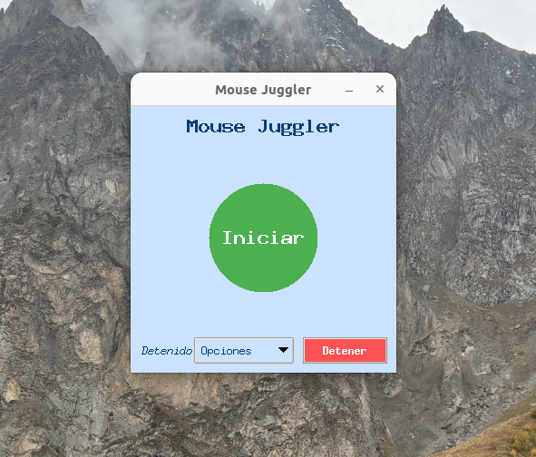

# Mouse Juggler


Mouse Juggler is an automation tool to move the mouse in a natural way, simulating human movements using Bezier curves. It's useful for preventing inactivity lockouts in computer systems or for simulating online presence.



## 📥 Quick Downloads

| System  | Download Link                                                                                                            |
| ------- | ------------------------------------------------------------------------------------------------------------------------ |
| Windows | [Download .exe](https://github.com/ArturoSirvent/mouse-juggler/releases/latest/download/mouse-juggler-win.exe)           |
| macOS   | [Download macOS executable](https://github.com/ArturoSirvent/mouse-juggler/releases/latest/download/mouse-juggler-macos) |
| Linux   | [Download Linux executable](https://github.com/ArturoSirvent/mouse-juggler/releases/latest/download/mouse-juggler-linux) |

For all available versions, visit the [Releases page](https://github.com/ArturoSirvent/mouse-juggler/releases).

## Features

-   🖱️ Smooth and natural mouse movements using Bezier curves
-   ⚙️ Fully configurable parameters (speed, distance, pause)
-   🎮 User-friendly graphical interface (when Tkinter is available)
-   💻 Console mode for environments without graphical interface
-   ⌨️ Quick stop via any key press
-   🔄 Works on Windows, Linux, and macOS

## Requirements

-   Python 3.8 to 3.12
-   Dependencies:
    -   numpy
    -   pyautogui
    -   pynput

## Installation

### Option 1: Download Standalone Executable (Recommended)

1. Go to the [Downloads](#-quick-downloads) section above
2. Download the appropriate version for your operating system
3. Run the file directly - no installation required!

### Option 2: From PyPI

```bash
pip install mouse-juggler
```

### Option 3: From Source Code

1. Clone the repository:

    ```bash
    git clone https://github.com/ArturoSirvent/mouse-juggler.git
    cd mouse-juggler
    ```

2. Install dependencies:
    ```bash
    pip install -r requirements.txt
    ```

## Usage

### Using the graphical interface

Run the `mouse_juggler.py` script:

```bash
python mouse_juggler.py
```

The interface will allow you to:

-   Configure movement parameters
-   Start and stop the automatic movement
-   See the current status of the application

### Console mode

Console mode is automatically activated when Tkinter is not available:

```bash
python mouse_juggler.py
```

To stop the application, simply press any key or <kbd>Ctrl</kbd>+<kbd>C</kbd>.

### Command line arguments

_This feature is in development and will be available in a future version_

## Configuration

Configurable parameters include:

| Parameter     | Description                                      |
| ------------- | ------------------------------------------------ |
| ΔX min/max    | Minimum/maximum horizontal displacement (pixels) |
| ΔY min/max    | Minimum/maximum vertical displacement (pixels)   |
| Speed min/max | Minimum/maximum speed (pixels/second)            |
| Pause min/max | Pause time between movements (seconds)           |
| Steps min/max | Number of points in each movement curve          |

## Creating Executable Releases

### Building Standalone Executables

Mouse Juggler can be built into standalone executables using PyInstaller. This allows users to run the application without installing Python or dependencies.

#### Prerequisites

```bash
pip install pyinstaller
```

#### Building the Executable

```bash
# For Windows
pyinstaller --onefile --windowed --icon=docs/images/icon.ico --name=mouse-juggler main.py

# For Linux
pyinstaller --onefile --name=mouse-juggler main.py

# For macOS
pyinstaller --onefile --windowed --icon=docs/images/icon.icns --name=mouse-juggler main.py
```

The executable will be created in the `dist` directory.

### Automatic Releases

This project uses GitHub Actions to automatically generate executables for Windows, macOS and Linux when a new version tag is published. The workflow:

1. Compiles platform-specific executables
2. Creates a new GitHub Release
3. Attaches the executables to the release for easy download

To create a new release:

1. Tag the commit with a version (e.g., `v1.0.1`)
2. Push the tag to GitHub
3. GitHub Actions will automatically build and publish the release

```bash
git tag v1.0.1
git push origin v1.0.1
```

You can also manually trigger a release from the GitHub Actions tab.

### Using pre-built binaries

1. Go to the [Releases](https://github.com/ArturoSirvent/mouse-juggler/releases) page
2. Download the appropriate version for your operating system:
    - `mouse-juggler-win64.exe` for Windows
    - `mouse-juggler-macos` for macOS
    - `mouse-juggler-linux` for Linux
3. Run the executable directly (no installation needed)

### Creating a Release Package

The project includes scripts to generate release packages with all necessary files:

```bash
# Generate release packages for all supported platforms
python scripts/make_release.py
```

This will create distribution packages in the `dist` directory.

## Project Structure

```
mouse-juggler/
├── main.py               # Entry point script
├── mouse_juggler.py      # Core application logic
├── requirements.txt      # Package dependencies
├── setup.py              # Installation configuration
├── docs/                 # Documentation files
│   ├── images/           # Screenshots and icons
│   └── TECH_DETAILS.md   # Technical details
├── scripts/              # Build and release scripts
│   ├── make_release.py   # Release generation script
│   └── build_exe.py      # Platform-specific build scripts
└── tests/                # Test scripts
    └── test_basic.py     # Basic functionality tests
```

## How it works

The program uses quadratic Bezier curves to create smooth movement paths:

1. A random destination point is selected within the configured range
2. A Bezier curve is generated between the current position and the destination
3. The cursor moves along the curve at a random speed
4. A pause is made before the next movement

## Contributing

Contributions are welcome! If you want to improve Mouse Juggler, please:

1. Fork the repository
2. Create a branch for your feature (`git checkout -b feature/new-feature`)
3. Make your changes and commit (`git commit -am 'Add new feature'`)
4. Push your changes (`git push origin feature/new-feature`)
5. Create a Pull Request

See [CONTRIBUTING.md](CONTRIBUTING.md) for more details.

## License

This project is licensed under the MIT License - see the [LICENSE](LICENSE) file for more details.

## Acknowledgements

-   The [PyAutoGUI](https://pyautogui.readthedocs.io/) library for facilitating mouse automation
-   [NumPy](https://numpy.org/) for efficient mathematical operations
-   [pynput](https://pynput.readthedocs.io/) for key detection
-   [PyInstaller](https://www.pyinstaller.org/) for creating standalone executables
